# <div align="center"> Segmentation Tool (SegTool)</div>
#### <div align="center"> The *Segmentation Tool* was designed to create unbiased ground truth data for multiplexIF imagery. </div>
#### <div align="center">Correspondence to: bgreen42@jhu.edu</div>

## 1. Description
This tool was designed to compare two segmentation maps in the efforts to design an unbaised ground truth segmentation. The app comparison starts by using the argmax(Intersection \ Union) for each object in the two segementations. Each object is then displayed to the user on at a time so that they can compare the two segmentation approaches. The user can select one of the two algorithm results or draw their own annotation for each cell. The user can also add cells as they see fit. 

## 2. Getting Started
There are two ways to launch the tool.

1. Through MATLAB: 
   1. check out the repository
   1. navigate to the repo. Open the `SegTool.mlapp`. The app designer will open. 
   1. In the task bar click the green run arrow. 
      1. *NOTE:* This is also the window to edit the app. There are two views the `Desgn View` and the `Code View`. You can toggle the views in the top right of the app designer window. 
1. Install the tool and open from the icon. 
   1. download the installer.exe located [here](SegmentationTool/for_redistribution)
   1. double click on the installer.exe to launch it
   1. *NOTE:* If the installer fails this is typically b/c of a failed MATLAB runtime install. Download and install MATALB Runtime_R2020a_win64 separately, then retry the `SegTool` installer.

## 3. Contents
- [1. Description](#1-description "Title")
- [2. Getting Started](#2-getting-started "Title")
- [3. Contents](#3-contents "Title")
- [4. Background](#4-background "Title")
- [5. File Structure](#5-file-structure "Title")
- [6. Usage](#6-usage "Title")
- [7. Saving Output](#7-saving-output "Title")
- [8. Combing Ground Truth Results](#8-combining-ground-truth-results "Title")
- [9. Settings](#9-changing-settings "Title")

## 4. Background
Robust cell segmentation in mIF imagery is vital for assessing the performance of different biomarkers in the TME. However, commonly available software for segmentation is both inefficient and inaccurate.  We aim to develop new algorithms for cell segmentation, either through machine learning or neural network methods. In order to train a neural network and assess the accuracy of any new approach to segmentation we will need a large dataset of ‘ground truth’ annotated cell objects. The manual annotation of every cell in hundreds of images required for a comprehensive ‘ground truth’ dataset is an exhaustive and time consuming process. 

Here we present a tool to aid in the development of such a ‘ground truth’ dataset for mIF images to alleviate some of these travails. The tool was designed to compare cells identified by two segmentation algorithms and prompts users to select which segmentation algorithm had better performance. In the initial stage, the tool displays matching cell pairs from both alogrithms, determined by per pixel overlap, to the user one at a time. The user is blinded to which segmentation algorithm was used and can add or remove cells with proximity to the current cell. In a final stage, users can look over the entire image to edit the segmentation either by paning the image or by using a smaller moving window.  

The tool was initially designed to compare cells from a super-pixel approach to segmentation, developed by Dr. Seyoun Park, to cells identified by the so-called ‘multi-pass’ inForm cell segmentation used as part of the initial AstroPath publication. As a result we use 'superpixel' and 'inform_data' (or abbreviations SP and IF) to denote the two algorithms throughout. However, any pair of multi-layer tiff label matrix outputs can be used for editing/comparing segmentation by changing values in the settings window - see section 9 for more details.

This document begins with a description on the workflow steps take in the UI, then designates the necessary directory structure of the image outputs, provides a step-by-step instruction for using the tool, and finally defines the comparison output files. 

## 5. File Structure
The program relies that the images files are set up in a unique file structure which is modeled after the Clinical Specimen directory structure, in order to find the corresponding inform images. In summary, there should be two adjacent directories for a given slide as follows: <br>
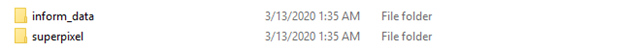<br><br>
Each folder should contain their own respective ‘Component_Tiffs’ folder, the images for each algorithm should reside in their respective folder. <br><br>
As a more distinct definition for this structure we first split the directory tree into 4 main parts which will be labeled “root”, “slideID”, ”SP_tree”, and ”IF_tree”. <br>
```<root>\<slideID>\<SP_tree>\<SP_Image> OR <root>\<slideID>\<IF_tree>\<IF_Image>```<br><br>
EX. “\\bki04\Segmentation\TMAs\Liver_TMA_145_23_01.30.2020\superpixel\Component_Tiffs\Liver_TMA_145_23_01.30.2020_[6435,55763]_component_data_seg.tif”
```
<root>: “\\bki04\Segmentation\TMAs”
<slideID>: “Liver_TMA_145_23_01.30.2020”
<SP _tree>: “superpixel\Component_Tiffs”
<SP _Image>: “Liver_TMA_145_23_01.30.2020_[6435,55763]_component_data_seg.tif”
```
For the corresponding inForm image, replace the <SP_tree> with the <IF_tree> as follows: <br><br>
EX. “\\bki04\Segmentation\TMAs\Liver_TMA_145_23_01.30.2020\inform_data\Component_Tiffs\Liver_TMA_145_23_01.30.2020_[6435,55763]_component_data_w_seg.tif”
```
<root>: “\\bki04\Segmentation\TMAs”
<slideID>: “Liver_TMA_145_23_01.30.2020”
<IF_tree>: “inform_data\Component_Tiffs”
<IF_Image>: “Liver_TMA_145_23_01.30.2020_[6435,55763]_component_data_w_seg.tif”
```

**Note: Be sure to use the component_data_w_seg.tif for the IF image or the software will throw an error.**

## 6. Usage
### 6.1 Launching and getting started
1.	Launch the program either by double clicking on the icon:  
  
or by locating the SegmentationTool.exe (see above in [Getting Started](#2-getting-started "Title")).
    1. An icon will appear on the windows tool bar:  

    1. A loading visual will appear on the desktop:  
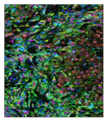
    1. The visual and icon may disappear then the app will open. This may take a few minutes and is normal. 
1.	Click on the ‘Load new image’ button: <br> 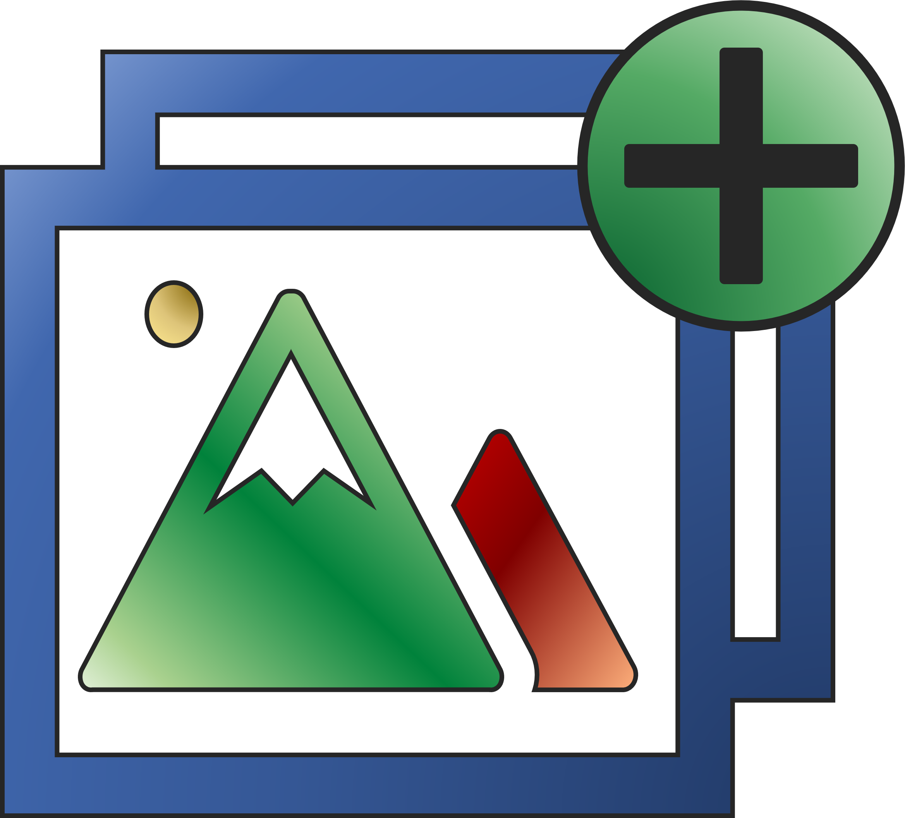
1.	A windows file explorer should open, navigate to either the <SP_tree> or <IF_tree>folder and open the <SP_Image> or  <IF_Image> of interest.
1.	If the file structure was set up appropriately, the program will find the corresponding segmentation output image, otherwise it will throw an error.
1.	The segmentation overlap in the images will be computed or, if it exists, the corresponding overlap image and .csv file comparison will be loaded for the image.
1.	The first cell for comparison will appear in the UI as a set of four images.
    1.	The top images will contain only the DAPI signal, the bottom images will contain the DAPI and the Membrane signal
    1.	On the left will be used to display the machine learning or superpixel segmentation and the right will be used to display the inform segmentation
1. Select  to jump to the final review stage (described in 6.10). Note that this can be selected before an image is loaded, if an image is loaded you may have to select 'Next Cell' for additional action to take place.

### 6.2 Selecting a segmentation approach
Once the first cell appears, the figure title will be populated with the image name and the cell pair count. 
1.	Select one of the 7 options in the classification box on the right panel (only one can be selected at a time and when selected the option will turn green):  
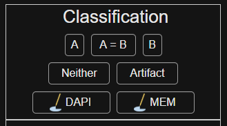
    1.	‘A’: the image segmentation on the left or ‘A’ side panel is more correct
    1.	‘B’: the image segmentation on the right or ‘B’ side panel is more correct
    1.	‘A=B’: both segmentations are correct
    1.	‘Neither’: This cell is thrown out for some other reason, both segmentations failed and a new cell cannot be drawn on
    1.	‘Artifact’: The segmentation is a result of image artifact and not an actual cell
    1.	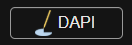: this option allows for drawing a segmentation on the ‘B’ panel DAPI only image. (Drawing explained below)
    1.	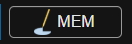: this option allows for drawing a segmentation on the ‘B’ DAPI + Membrane image. (Drawing explained below)
1.	Select ‘Next cell’
    1.	This jumps to the next cell that has not yet been reviewed 
       1.	Sometimes this means skipping cells  
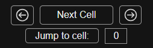

### 6.3 Additional movement buttons
1.	: this goes back one cell in the numeric ordering (shown in the figure header at the top of the page)
1.	: this moves forward a single cell and a single cell only in the numeric ordering. This differs from the ‘Next cell’ button by ignoring which cells have already been checked off.
1.	‘Jump to cell’: this button jumps to the cell pair entered in the input box beside it. This can be used to ask for confirmation or review the segmentation of a given cell pair.

### 6.4 Display buttons
1.	The brightness and the contrast of the DAPI and Membrane can be scaled separately. Select the marker of interest, then vary the appropriate parameter with the slider. Only one option can be selected at a time. When the option is selected the button turns green.  
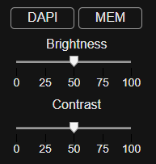
1.	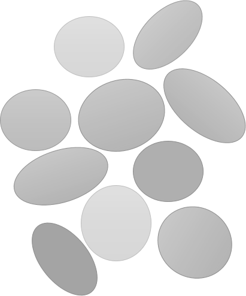: Toggles the segmentation on and off for all four image stamps. The segmentation show is the original segmentation for either ‘A’ or ‘B’ respectively.
1.	: Toggles the already applied segmentation on and off for all four image stamps. This shows the reviewed cells or the cells in the joint overlap group (if it has not been removed). 

### 6.5 Additional flagging buttons
Any combination of these options can be applied to a give cell pair.  
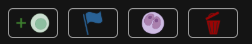
1.	: adds a review flag to this cell. When the segmentation is finished and handed off for statistics or review by another person they can review these cells for edits. 
1.	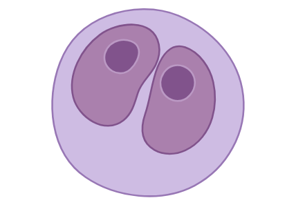: Indicates that the cell pair is part of a multi nucleated  cell
1.	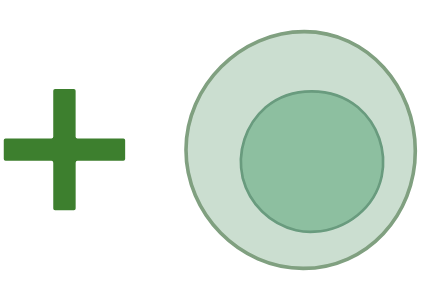: allows the user to add a new cell, see below
1. : allows the user to select cells in the top left panel and remove them. Click again to stop removing cells.
1. 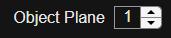: Moves the cell above or below other cells (when drawing images in the additional windows, this is set after the cell is drawn)

### 6.6 Add cell window
Opens the ‘Add cell window’, the main app will be shaded in and not usable when this window opens. The new window will look like this: <br> <br> 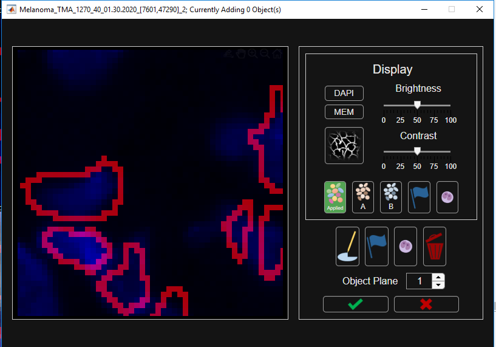 <br>
1.	The first time this option is selected a dialog with directions appears over the window. Click 'OK' to continue.
1. Click on  and wait for it to turn green in that UI to draw a cell. 
1. There are two methods for drawing (see section 6.7 for more drawing help)
   1. left click and hold, then drag the annotation around the cell, and close the cell by right clicking
   1. left click, release and left click again to add 'waypoints' around the cell, and right click to close the cell.
1. To add a new cell, click on  again.
1.	The segmentation and display settings are all the same asin the main app but there are a few additional options:
    1. 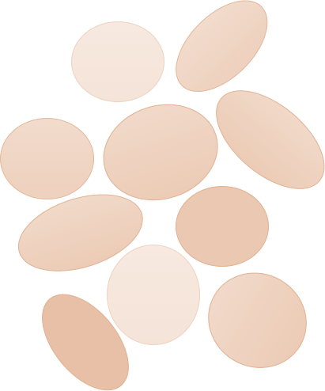: to show the segmentation map for option 'A' on the previous window.
    1. 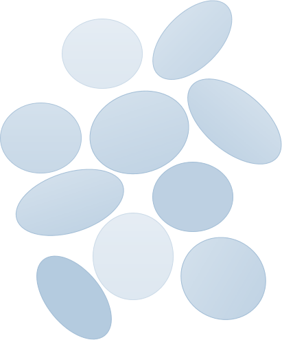: to show the segmentation map for option 'B' on the previous window.
    1. 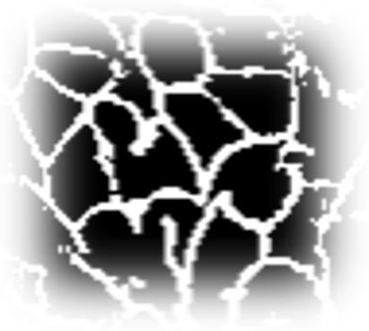: to toggle the membrane segmentation on and off.
1.	To redraw a cell you will first need to delete it by selecting the trash can icon, then selecting that cell.
1.	The number of cells drawn are recorded in the window header  
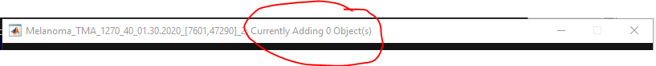
1.	Once finished adding cells, select either  to accept all drawn cells or  to reject drawn cells. A confirmation dialog will open either way.

### 6.7 Drawing feature
When one of the drawing options is selected
1.	Move the cursor over the corresponding image. For the main app window (when selecting between A and B):
    1. Always use the right or 'B' side image to draw
    1. The top or bottom panel depends on the button used
    1. : will allow drawing on the top panel
    1. : allows drawing on the bottom panel.
1.	There are two options for drawing the segmentation. 
    1.	Click and drag
        1.	Left click and hold
        1.	then drag around the cell to draw (while holding the left mouse button)
        1.	Release the left click and right click to end the segmentation
    1.	Create waypoints
        1.	Left click once on the segmentation
        1.	 release
        1.	Then move the mouse and left click again
        1.	Do this all the way around the cell, creating ‘waypoints’ 
        1.	right click on the mouse to end the segmentation

### 6.8 Additional notes for segmentation selection
- 	If one of the two segmentations are correct, select that segmentation before rejecting or drawing a new segmentation.
-	Since the cells are usually ordered by location, segmentation on adjacent cells may show up later on. Often this means that over-segmented or under-segmented examples are directly next to each other. If one of the approaches correctly defines the over-segmented cell, it is safe to reject the second cell that appears or select the correct version again.
- For example: 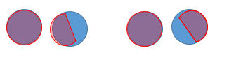

### 6.9 Highly overlapping pairs
When the overlaps are computed, some of the cells are computationally determined to be the same cells, these are the so-called ‘highly overlapping pairs’. It is assumed that these objects, because of their agreement are correctly identifying the cell of interest. A random sample of these pairs are filter back into the cells for review to assess the viability of this criteria for each image. If 20% of these sampled pairs have disagreement (were not defined as ‘A=B’) then this dialog will appear and the rest of these highly overlapped pairs are added back in for the user to review. The cell objects are also removed from the applied segmentation.  


### 6.10 Finishing an image
1.	When all cells in an image are reviewed, a prompt will open telling the user that all cell pairs have been review and that it is now time to review the whole image. The prompt will ask the user if the segmentation should be cleaned up. This will run an algorithm that detects if cells in the final segmentation results are occluding each other and removes these 'duplicate' cells. 
1.	A new window will open, as below, which shows the whole image with similar drawing features as the ‘Add cell’ window. You will be able to see the applied segmentation on the whole image and identify any cells that may have been missed by both algorithms.  
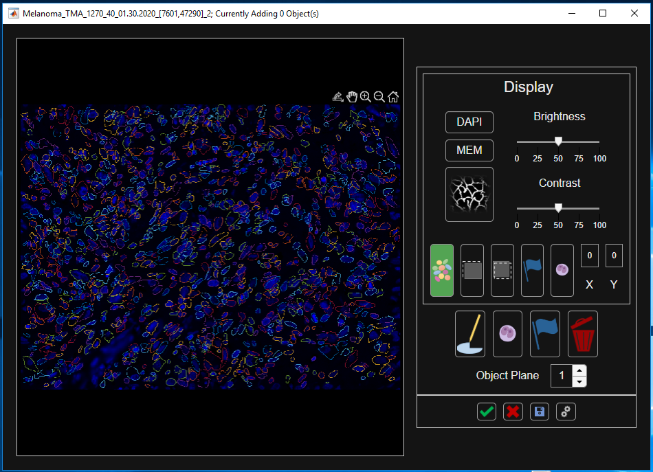
1.	Edit annotations by using the trash can icon to remove missegmented cells and the drawing utility to draw new ones. (6.7 has helpful hints on how to draw new cells)
1.	Select  to accept all cells or  to reject them.

#### 6.10.1 Additional Buttons
1. : toggle the applied segmentation mask on and off.
1.	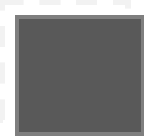: masks out the area where cells are annotated in black.
1. 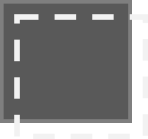: masks out regions not annotated in a transparent grey.
1.  : When selected in the 'Display' panel will mask all the cells flagged. When selected in the lower panel, will allow the user to click on a cell and flag it.
1.  : When selected in the 'Display' panel will mask all the cells marked as multi-nucleated. When selected in the lower panel, will allow the user to click on a cell and mark it as multi-nucleated.
1.  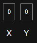: Use the X and Y values to move across the image in a grid of 200 x 200 pixels. Regions outside the tile will be grayed out. Set X or Y to 0 to turn off.

## 7. Saving Output
### 7.1 Saving and closing
There are a few ways to save progress. 
1.	The first way is to select the ‘Save Table’ button at the bottom of the right panel: 
1.	The second way is during the closing of the app. Close the app by clicking the ‘X’ in the upper right corner. A new closing dialog will appear: <br> 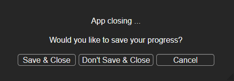
    1.	 ‘Save & Close’: saves progress and closes the app
    1.	‘Don’t Save & Close’: will not save progress and closes the app
    1.	‘Cancel’ or clicking the ‘X’ from this box will cancel the closing dialog and return to the app for segmentation
1.	The UI will also save the current result if a new image is loaded into the UI
When the tool saves, a saving progress bar will open over the UI. The UI will not be usable while the save is operating and will appear greyed out. Wait for the UI to finish saving before closing or logging off. 

### 7.2 Image Output
The tool saves two files, both files are labeled with the file indication ‘comparison_seg_data’ after the image name. The first file is a csv file with 14 column headers, the second is a tiff file with 2 image layers.
1.	Csv file:
    1.	This file contains information on each cell object in the image 
    1.	Column description:
        1.	IF_cellid
            1.	Description: Numeric cellid from the IF_cellid label matrix
            1.	Data type: Uint16
        1.	IF_X_centroid
            1.	Description: X value for the centroid of the IF cell
            1.	Data type: Float32
        1.	IF_Y_centroid
            1.	Description: Y value for the centroid of the IF cell
            1.	Data type: Float32
        1.	SP_paired_w_IF
            1.	Description: the corresponding SP cellid that is paired to this IF cellid
            1.	Data type: Uint16
        1.	SP_cellid
            1.	Description: Numeric cellid from the SP_cellid label matrix
            1.	Data type: Uint16
        1.	SP_X_centroid
            1.	Description: X value for the centroid of the SP cell
            1.	Data type: Float32
        1.	SP_Y_centroid
            1.	Description: Y value for the centroid of the SP cell
            1.	Data type: Float32
        1.	IF_paired_w_SP
            1.	Description: the corresponding IF cellid that is paired to this SP cellid
            1.	Data type: Uint16
        1.	pairid
            1.	Description: the new unique cellid given to cell pairs in the table
            1.	Data type: Uint16
        1.	IF_level
            1.	Description: the corresponding image segmentation type for the InForm segmentation a cell comes from. 
            1.	Data type: Uint8
            1.	Opts: 
                1.	1: immune cell segmentation layer
                1.	2: tumor cell segmentation layer
        1.	joint_overlap
            1.	Description: joint fractional overlap, from multiplying the fractional overlaps of each type or IF_frac * SP_frac
            1.	Data type: Float32
        1.	class_selection
            1.	Description: which segmentation is saved in the final result
            1.	Data type: Uint8
            1.	Opts:
                1.	(0): not yet defined
                1.	(1): Inform type
                1.	(2): super pixel type
                1.	(3): drawn on
                1.	(4): joint overlap over .8 and set NOT to review
                1.	(5): reviewed as both
                1.	(6): added \ new cell
                1.	(-1): neither segmentation chosen and not drawn
                1.	(-2): artifact
        1.	cell_check
            1.	Whether or not that cell will be reviewed
            1.	Data type: Uint8
            1.	Opts:
                1.	(0): do not review (see (4) in class selection)
                1.	(1): review 
                1.	(2): joint overlap over .8 and set to review 
Note: Cells can be repeated for each corresponding cell they overlap over 10% with, so all overlapped cells are included.
1.	TIFF file
    1.	This file contains 2 label matrices to be used in conjunction with the csv file to produce the final segmentation result or for display in the UI
    1.	Data type: Uint16
    1.	Opts:
        1.	Cell objects that were draw in the UI, values correspond to the pairid’s in the table above
        1.	The applied segmentation matrix, a binary mask only used to create a visual display
### 7.3 Rebuilding the label matrix
To rebuild the label matrix one must read in the superpixel segmentation mask and the inform segmentation mask. Select the cells for each pairid using corresponding cell selection value. For IF or SP use the cellid values to located to cells. For drawn cells, use layer 1 of the ‘comparison_seg_data.tif’ image.  Currently this is done in numeric pairid order, meaning that if a cell later in the pairs, overlaps with another, it will override the previous pairid.

## 8. Combining Ground Truth Results
The segmentation status for annotators is kept in the Segmentation_eval.xlsx document in the notes folder of the repo. Numeric ids can be found in the NumericIDs.csv file. To combine results run `gather_simil()` from the *QC* repo directory on the image directory. 

`gather_simil(wd, P, imname, N)` 

Input:
- `wd`: the directory to the trainingimages where each annotator has a subfoler: 'SegmentationImages_PP' (where PP is the person's intials).
- `P`: cell array containing the extensions after the '\_' on annotators annotation folder for each annotator that has completed the image of interest
  - ex. for SegmentationImages_SS it would be {'SS'}
- `imname`: the image name up to the image coordinates
  - ex.  'Liver_TMA_145_23_01.30.2020_\[6435,55763]'
- `N`: cell array containing the numeric ID from the NumericIDs.csv file which will be added as an extension to the final image
 
Output:
a combined image in a *wd\\..\upkeep\Results* folder with the segmentation label images named by the image names and appended with *_comparison_seg_data_final_01*. Also includes a .csv file with the MultiNuc flag status indicating if the user flagged the cell as being multi-nucleated. 

Examples for running this code are found in the t1.m, t2.m, and t3.m files where each of the previous results were run and generated. 

To cut the large images into smaller images using the `cut_big_image` function in the QC folder. Which takes in a directory with the superpixel and component_tiff subfolders as described in section 6 and an image name as desribed for `gather_simil`. 

## 9. Changing Settings

A settings window can be opened by selecting the gears button . One of the options in this window is the 'Segmentation Shading', this can be changed between 0-1 to increase or reduce the shading alpha of the segmentation masks. The rest of the settings indicate variables important when loading the image. 

There are specific data type settings for the two segmentations being compared:
- input data: the name of the folder in the folder tree from section 5.
- boundary format: is the label matrix input a mask or a boundary label matrix.
- table abbreviation: indicates the abbreviation applied to the output tables, note that once an image set comparison has started the code specifies the names as column headers. To reload old results these abbreviations must be consistent with the previously used abbreviations.
- boundary layers: a comma separated list of the boundary layers to use in the multi-layer tiff inputs with segmentation. These layers are combined into a single layer. Cells overlapping will be overridden by successive layers so that there is a single layer segmentation mask.

We can also specify if the segmentation/annotations of interest is the membrane or the nucleus and which layers of the image to use for visualization.
