# 
 Segmentation Tool (SegTool)

#### 
 The *Segmentation Tool* was designed to create unbiased ground truth data for multiplexIF imagery. 

#### 
Correspondence to: bgreen42@jhu.edu

## 1. Description
This tool was designed to compare two segmentation maps in the efforts to design an unbaised ground truth segmentation. The app comparison starts by using the argmax(Intersection \ Union) for each object in the two segementations. Each object is then displayed to the user on at a time so that they can compare the two segmentation approaches. The user can select one of the two algorithm results or draw their own annotation for each cell. The user can also add cells as they see fit. 

## 2. Getting Started
There are two ways to launch the tool.

1. Through MATLAB: 
   1. check out the repository
   1. navigate to the repo. Open the `SegTool.mlapp`. The app designer will open. 
   1. In the task bar click the green run arrow. 
      1. *NOTE:* This is also the window to edit the app. There are two views the `Desgn View` and the `Code View`. You can toggle the views in the top right of the app designer window. 
1. Install the tool and open from the icon. 
   1. download the installer.exe located [here](SegmentationTool/for_redistribution)
   1. double click on the installer.exe to launch it
   1. *NOTE:* If the installer fails this is typically b/c of a failed MATLAB runtime install. Download and install MATALB Runtime_R2020a_win64 separately, then retry the `SegTool` installer.

## 3. Contents
- [1. Description](#1-description "Title")
- [2. Getting Started](#2-getting-started "Title")
- [3. Contents](#3-contents "Title")
- [4. Background](#4-background "Title")
- [5. Workflow](#5-workflow "Title")
- [6. File Structure](#6-file-structure "Title")
- [7. Usage](#7-usage "Title")
- [8. Saving Output](#8-saving-output "Title")
- [9. Combing Ground Truth Results](#9-combining-ground-truth-results "Title")
- [10. Potential Edits](#10-potential-edits "Title")

## 4. Background

## 5. Workflow

## 6. File Structure

## 7. Usage
### 7.1 Launching and getting started
1.	Launch the program either by double clicking on the icon:  
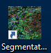  
or by locating the SegmentationTool.exe (see above in [Getting Started](#2-getting-started "Title")).
    1. An icon will appear on the windows tool bar:  
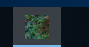
    1. A loading visual will appear on the desktop:  
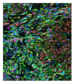
    1. The visual and icon may disappear then the app will open. This may take a few minutes and is normal. 
2.	Click on the ‘Load new image’ button:  
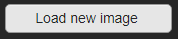
3.	A windows file explorer should open, navigate to either the <SP_tree> or <IF_tree>folder and open the <SP_Image> or  <IF_Image> of interest.
4.	If the file structure was set up appropriately, the program will find the corresponding segmentation output image, otherwise it will throw an error.
5.	The segmentation overlap on the images will be computed or, if it exists, the corresponding overlap image and .csv file comparison will be loaded for the image.
6.	The first cell for comparison will appear in the UI as a set of four images.
    1.	The top images will contain only the DAPI signal, the bottom images will contain the DAPI and the Membrane signal
    1.	On the left will be used to display the machine learning or superpixel segmentation and the right will be used to display the inform segmentation
### 7.2 Selecting a segmentation approach
Once the first cell appears, the figure title will be populated with the image name and the cell pair count. 
1.	Select one of the 7 options in the classification box on the right panel (only one can be selected at a time and when selected the option will turn green):  
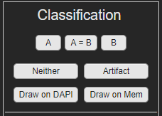
    1.	‘A’: the image segmentation on the left or ‘A’ side panel is more correct
    1.	‘B’: the image segmentation on the right or ‘B’ side panel is more correct
    1.	‘A=B’: both segmentations are correct
    1.	‘Neither’: This cell is thrown out for some other reason, both segmentations failed and a new cell cannot be drawn on
    1.	‘Artifact’: The segmentation is a result of image artifact and not an actual cell
    1.	‘Draw on DAPI’: this option allows for drawing a segmentation on the ‘B’ panel DAPI only image. (Drawing explained below)
    1.	‘Draw on Mem’: this option allows for drawing a segmentation on the ‘B’ DAPI + Membrane image. (Drawing explained below)
2.	Select ‘Next cell’
    1.	This jumps to the next cell that has not yet been reviewed 
       1.	Sometimes this means skipping cells  
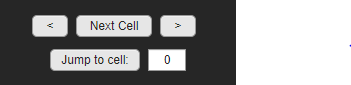
### 7.3 Additional movement buttons
1.	‘<: this goes back one cell in the numeric ordering (shown in the figure header at the top of the page)
2.	‘>’: this moves forward a single cell and a single cell only in the numeric ordering. This differs from the ‘Next cell’ button by ignoring which cells have already been checked off.
3.	‘Jump to cell’: this button jumps to the cell pair entered in the input box beside it. This can be used to ask for confirmation or review the segmentation of a given cell pair.
### 7.4 Display buttons
1.	The brightness and the contrast of the DAPI and Membrane can be scaled separately. Select the marker of interest, then vary the appropriate parameter with the slider. Only one option can be selected at a time. When the option is selected the button turns green.  
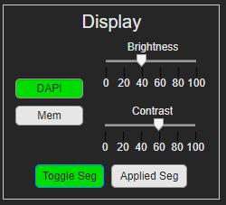
2.	‘Toggle Segmentation’: Toggles the segmentation on and off for all four image stamps. The segmentation show is the original segmentation for either ‘A’ or ‘B’ respectively.
3.	‘Applied Seg’: Toggles the already applied segmentation on and off for all four image stamps. This shows the reviewed cells or the cells in the joint overlap group (if it has not been removed). 
### 7.5 Additional flagging buttons
Any combination of these options can be applied to a give cell pair.  
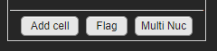
1.	‘Flag’: adds a review flag to this cell. When the segmentation is finished and handed off for statistics or review by another person they can review these cells for edits. 
2.	‘Multi Nuc’: Indicates that the cell pair is part of a multi nucleated  cell
3.	‘Add cell’: allows the user to add a new cell, see below
### 7.6 Add cell window
1.	Opens the ‘Add cell window’, the main app will be shaded in and not usable when this window opens. 
   a.	The first time this option is selected the following dialog with directions appears over the window.  
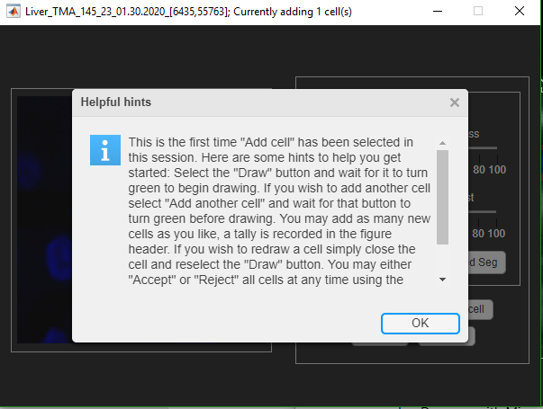
    1.	Follow these directions to use: 
        1.	Click on the ‘Draw’ button and wait for it to turn green in that UI to draw a cell. 
        1. To add a new cell click ‘add another cell’, wait for that button to turn green then draw another cell
            1.	there is no need to click draw again
        1.	The segmentation and display settings are all the same as before
            1.	except now there is an option to toggle only the membrane stain (with ‘Show Mem’ check box), ‘Seg A’ and ‘Seg B’
            1.	note that the applied segmentation is updated in real time.
         1.	To redraw a cell, close the current cell by right clicking in the drawing window (see 4.7 for additional drawing notes), then click on the ‘Draw’ button again
         1.	The number of cells drawn are recorded in the window header  

1.	Once finished adding cells, select either ‘Accept’ to accept all drawn cells or ‘Reject’ to reject drawn cells. A confirmation dialog will open either way
    1.	Reject confirmation dialog options
        1.	for the reject dialog, if only one cell is drawn the dialog just asks for confirmation
        1.	for the reject dialog, if more than one cell is drawn the dialog asks if all drawn cells should be deleted or only the last cell drawn
### 7.7 Drawing feature
When one of the drawing options is selected
1.	Move the cursor over the corresponding image (DAPI or Membrane + DAPI). 
2.	There are two options for drawing the segmentation. 
    1.	Click and drag
        1.	Left click and hold
        1.	then drag around the cell to draw (while holding the left mouse button)
        1.	Release the left click and right click to end the segmentation
    1.	Create waypoints
        1.	Left click once on the segmentation
        1.	 release
        1.	Then move the mouse and left click again
        1.	Do this all the way around the cell, creating ‘waypoints’ 
        1.	right click on the mouse to end the segmentation
### 7.8 Additional notes for segmentation selection
-	We are segmenting the nuclei only at this point
- 	If one of the two segmentations are correct select that segmentation before rejecting or drawing a new segmentation.
-	Since the cells are usually order by location, segmentation on adjacent cells may show up in sequential ordering. Often this means that over-segmented or under-segmented examples are directly next to each other. If one of the approaches correctly defines the over-segmented cell, it is safe to reject the second cell that appears or select the correct version again.

EX. 
Cell1:&nbsp;&nbsp;&nbsp;&nbsp;&nbsp;&nbsp;&nbsp;&nbsp;&nbsp;&nbsp;&nbsp;&nbsp;&nbsp;&nbsp;&nbsp;&nbsp;&nbsp;&nbsp;&nbsp;&nbsp;Cell2:  

### 7.9 Highly overlapping pairs
When the overlaps are computed, some of the cells are computationally determined to be the same cells, these are the so-called ‘highly overlapping pairs’. It is assumed that these objects, because of their agreement are correctly identifying the cell of interest. A random sample of these pairs are filter back into the cells for review to assess the viability of this criteria for each image. If 20% of these sampled pairs have disagreement (were not defined as ‘A=B’) then this dialog will appear and the rest of these highly overlapped pairs are added back in for the user to review. The cell objects are also removed from the applied segmentation.  
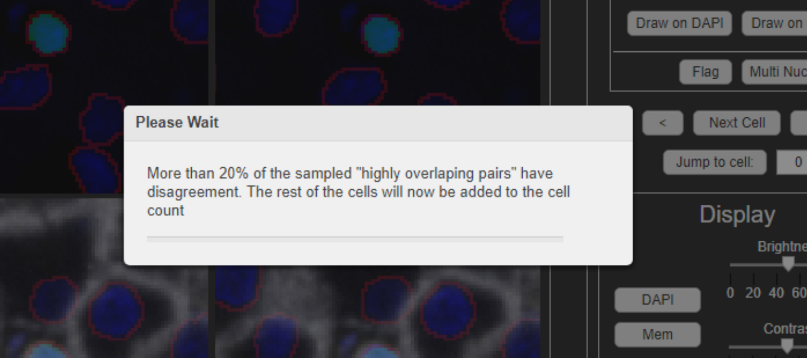
 

### 7.10 Finishing an image
1.	When all cells in an image are reviewed, a prompt will open telling the user that all cell pairs have been review and that it is now time to review the whole image
    1.	click ‘ok’
2.	A new window will open, as below, which shows the whole image with similar drawing features as the ‘Add cell’ window. You will be able to see the applied segmentation on the whole image and identify any cells that may have been missed by both algorithms.  
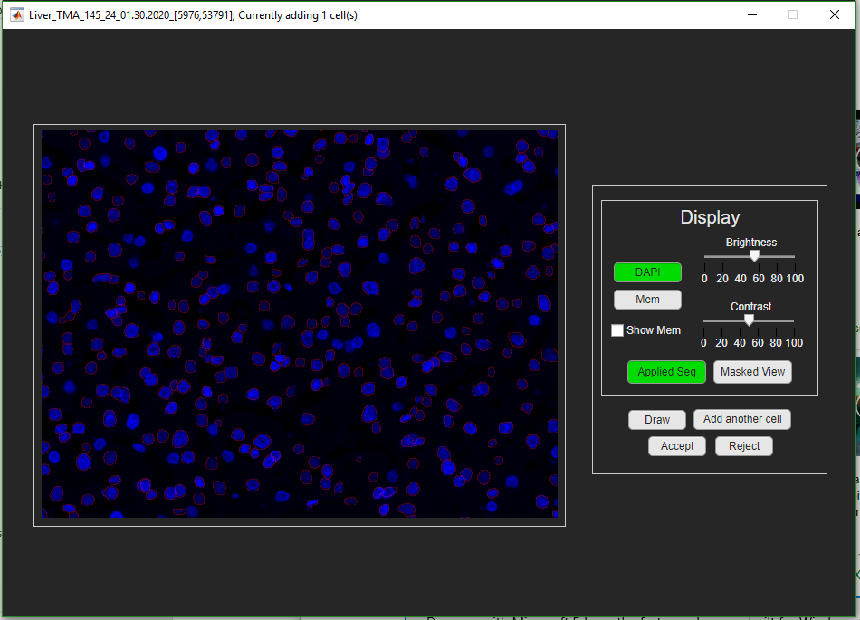
    1.	if you have not used the ‘Add cell’ button in this session the dialog from 4.6.1.a will appear.

3.	There will be an additional option for a ‘Masked View’, this subtracts the ‘applied seg’ cells out of the view, leaving only pixels that have not been segmented. This view is very helpful in identifying missed objects  
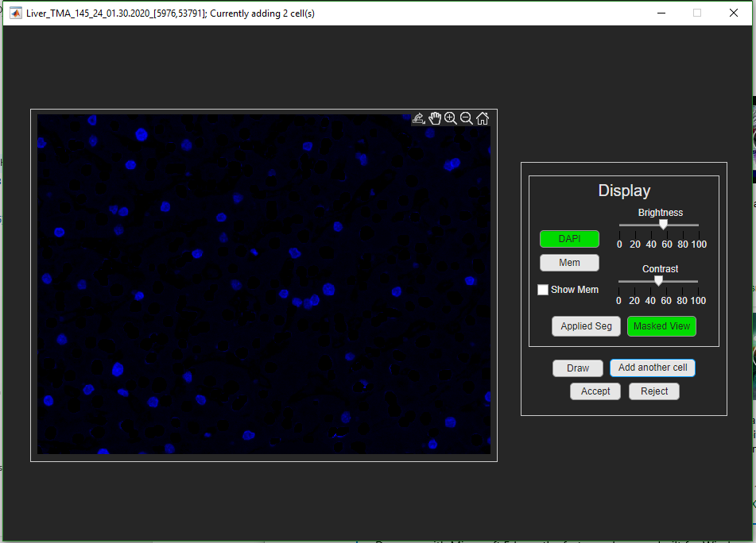
4.	Add all the additional cells desired until the whole image has been identified. 
5.	Select ‘Accept’ to accept all cells or ‘Reject’ to reject them
    1.	see 4.6.1 for more info on these options

## 8. Saving Output
### 8.1 Saving and closing
There are a few ways to save progress. 
1.	The first way is to select the ‘Save Table’ button at the bottom of the right panel:  
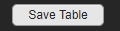
2.	The second way is during the closing of the app. Close the app by clicking the ‘X’ in the upper right corner. A new closing dialog will appear:  
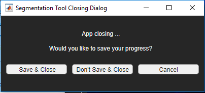
    1.	 ‘Save & Close’: saves progress and closes the app
    1.	‘Don’t Save & Close’: will not save progress and closes the app
    1.	‘Cancel’ or clicking the ‘X’ from this box will cancel the closing dialog and return to the app for segmentation
3.	The UI will also save the current result if a new image is loaded into the UI
When the tool saves, a saving progress bar will open over the UI. The UI will not be usable while the save is operating and will appear greyed out. Wait for the UI to finish saving before closing or logging off. 
### 8.2 Image Output
The tool saves two files, both files are labeled with the file indication ‘comparison_seg_data’ after the image name. The first file is a csv file with 14 column headers, the second is a tiff file with 2 image layers.
1.	Csv file:
    1.	This file contains information on each cell object in the image 
    1.	Column description:
        1.	IF_cellid
            1.	Description: Numeric cellid from the IF_cellid label matrix
            1.	Data type: Uint16
        1.	IF_X_centroid
            1.	Description: X value for the centroid of the IF cell
            1.	Data type: Float32
        1.	IF_Y_centroid
            1.	Description: Y value for the centroid of the IF cell
            1.	Data type: Float32
        1.	SP_paired_w_IF
            1.	Description: the corresponding SP cellid that is paired to this IF cellid
            1.	Data type: Uint16
        1.	SP_cellid
            1.	Description: Numeric cellid from the SP_cellid label matrix
            1.	Data type: Uint16
        1.	SP_X_centroid
            1.	Description: X value for the centroid of the SP cell
            1.	Data type: Float32
        1.	SP_Y_centroid
            1.	Description: Y value for the centroid of the SP cell
            1.	Data type: Float32
        1.	IF_paired_w_SP
            1.	Description: the corresponding IF cellid that is paired to this SP cellid
            1.	Data type: Uint16
        1.	pairid
            1.	Description: the new unique cellid given to cell pairs in the table
            1.	Data type: Uint16
        1.	IF_level
            1.	Description: the corresponding image segmentation type for the InForm segmentation a cell comes from. 
            1.	Data type: Uint8
            1.	Opts: 
                1.	1: immune cell segmentation layer
                1.	2: tumor cell segmentation layer
        1.	joint_overlap
            1.	Description: joint fractional overlap, from multiplying the fractional overlaps of each type or IF_frac * SP_frac
            1.	Data type: Float32
        1.	class_selection
            1.	Description: which segmentation is saved in the final result
            1.	Data type: Uint8
            1.	Opts:
                1.	(0): not yet defined
                1.	(1): Inform type
                1.	(2): super pixel type
                1.	(3): drawn on
                1.	(4): joint overlap over .8 and set NOT to review
                1.	(5): reviewed as both
                1.	(6): added \ new cell
                1.	(-1): neither segmentation chosen and not drawn
                1.	(-2): artifact
        1.	cell_check
            1.	Whether or not that cell will be reviewed
            1.	Data type: Uint8
            1.	Opts:
                1.	(0): do not review (see (4) in class selection)
                1.	(1): review 
                1.	(2): joint overlap over .8 and set to review 
Note: Cells can be repeated for each corresponding cell they overlap over 10% with, so all overlapped cells are included.
2.	TIFF file
    1.	This file contains 2 label matrices to be used in conjunction with the csv file to produce the final segmentation result or for display in the UI
    1.	Data type: Uint16
    1.	Opts:
        1.	Cell objects that were draw in the UI, values correspond to the pairid’s in the table above
        1.	The applied segmentation matrix, a binary mask only used to create a visual display
### 8.3 Rebuilding the label matrix
To rebuild the label matrix one must read in the superpixel segmentation mask and the inform segmentation mask. Select the cells for each pairid using corresponding cell selection value. For IF or SP use the cellid values to located to cells. For drawn cells, use layer 1 of the ‘comparison_seg_data.tif’ image.  Currently this is done in numeric pairid order, meaning that if a cell later in the pairs, overlaps with another, it will override the previous pairid.

## 9. Combining Ground Truth Results
The segmentation status for annotators is kept in the Segmentation_eval.xlsx document in the notes folder of the repo. Numeric ids can be found in the NumericIDs.csv file. To combine results run `gather_simil()` from the *QC* repo directory on the image directory. 

`gather_simil(wd, P, imname, N)` 

Input:
- `wd`: the directory to the trainingimages where each annotator has a subfoler: 'SegmentationImages_PP' (where PP is the person's intials).
- `P`: cell array containing the extensions after the '\_' on annotators annotation folder for each annotator that has completed the image of interest
  - ex. for SegmentationImages_SS it would be {'SS'}
- `imname`: the image name up to the image coordinates
  - ex.  'Liver_TMA_145_23_01.30.2020_\[6435,55763]'
- `N`: cell array containing the numeric ID from the NumericIDs.csv file which will be added as an extension to the final image
 
Output:
a combined image in a *wd\\..\upkeep\Results* folder with the segmentation label images named by the image names and appended with *_comparison_seg_data_final_01*. Also includes a .csv file with the MultiNuc flag status indicating if the user flagged the cell as being multi-nucleated. 

Examples for running this code are found in the t1.m, t2.m, and t3.m files where each of the previous results were run and generated. 

To cut the large images into smaller images using the `cut_big_image` function in the QC folder. Which takes in a directory with the superpixel and component_tiff subfolders as described in section 6 and an image name as desribed for `gather_simil`. 

## 10. Potential Edits
### edits for membrane segmentation
The code should be edited to add a dialog box to use membrane or nuclear segmentation. This dialog box should change the headers *current nuclear object* and extract the information from different layers in the superpixel and inform data. We should also append '\_mem' to the output image files from the tool (both when reading and writing). 

